**What is AWS EC2 Instance?**

EC2 instance is just a virtual server in AWS’s data center. It provides a resizable compute capacity in the cloud. You can quickly scale it up and down as per your requirements changes.

**What is CICD ?**

In this guide we will build a code deploys setup that takes our commits from github repo for our source codes and deploys it automatically on our servers. CICD practices in the most simplest form. This guide will focus more on CICD practices.

This guide assumes that you have an intention of understanding how GitHub can be integrated into code deploy as a source.

# **Table of Contents:**

1. The Requirements
2. Create IAM Role
3. Create and Launch EC2 Instance
4. Installation of Apache Web
5. Install Mysql Database
6. Install Nodejs and NPM
7. Create Github Repository
8. Create Nodejs Project
9. Configure AWS CodeDeploy Service
10. Running the Complete Pipeline

### **1. The Requirements**

To create the CI/CD pipeline, make sure to create these accounts first:

1. Go to Amazon Web Services Website. ([link](https://aws.amazon.com/))
2. Sign in to your AWS account using Root user if you don’t have account please create
3. For Sign In Click on My Account -> AWS Management Console.
4. Create Github Account. ([link](https://github.com/join))

### **2. Create IAM Role**

There are two types of role we need. one is EC2 instance role and CodeDeploy service role

***(i) EC2 Instance Role:***

IAM role for EC2 instances allows EC2 instances to call AWS services on your behalf and also we need to create one for code deploy

Select the IAM Services in the drop down list of aws services in your console

Go to roles -> create roles -> (choose the service that will use this role)EC2 -> next

In the search box search for ec2 role as in the image below

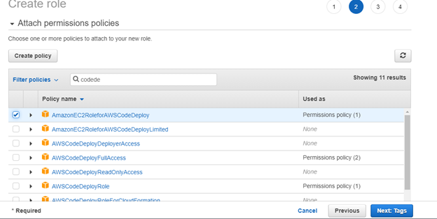

Click tags and fill in the details as you wish. In this case I will chose to leave the tags blank. Click next

Give it a Role name and leave description as it is then click create role.

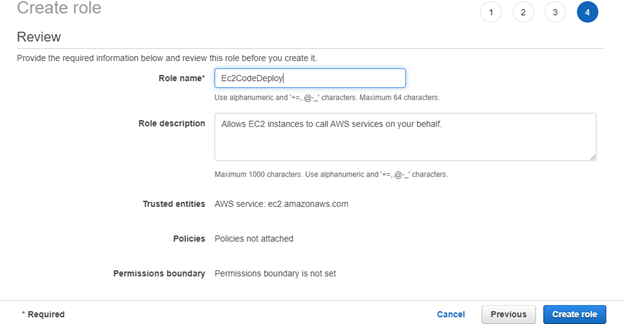

Click roles in the left panel and you should find the newly created role in the existing list

Navigate Navigate to the newly created role and click on it.

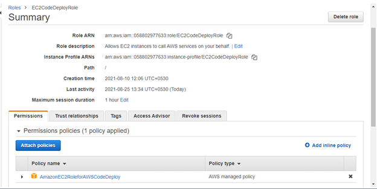

Click to trust relationship tap. (You can customize trust relationships by editing the following access control policy document).

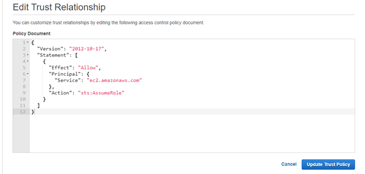

Once edited, click on **Update Trust Policy.**

> *We need to repeat the same process again but this time for code deploy to integrate with others aws services.*

***(ii) CodeDeploy Role:***

Select the IAM Service in the drop down list of aws services in your console

Go to roles -> create role > (choose the service that will use this tole) EC2 -> next

In the search box search for codedeploy as in the images below.

Create IAM for codeDeploy.

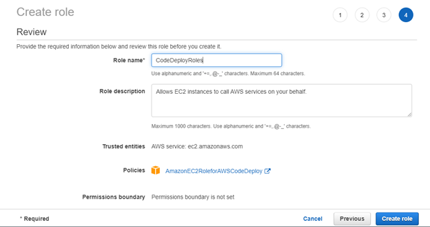

click roles in the left pane and you should find the newly created role in the existing list.

> So we have to set our policy with the same region as our ec2 instance we will be creating hence this syntax. So all we need to do is create our instances in the same region.

Navigate to the newly created role and click on it.

In Permissions tap click to attach policies -> add [AWSCodeDeployFullAccess](https://console.aws.amazon.com/iam/home#/policies/arn%3Aaws%3Aiam%3A%3Aaws%3Apolicy%2FAWSCodeDeployFullAccess)

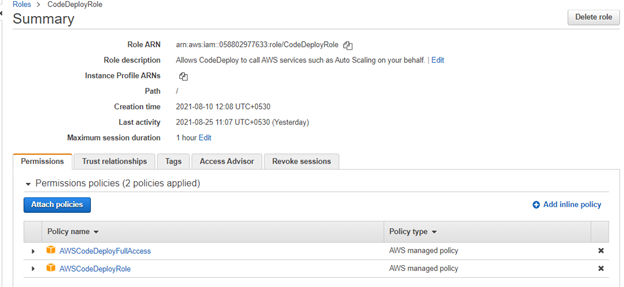

Click to trust relationship tap. (You can customize trust relationships by editing the following access control policy document.)

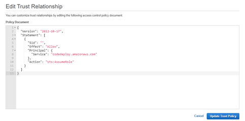

Once edited, click on **Update Trust Policy.**

All set! Now IAM roles are done.

### 3. Create and Launch EC2 Instance

1. in this AWS EC2 Tutorial, let’s understand the whole EC2 instance creation process through a use case in which we’ll be creating an Ubuntu instance for a test environment
2. **Select EC2 Services:** Click EC2 under compute section. This will take you to the EC2 dashboard.
3. **Click lunch instance:**
4. **1.** **Select an AMI:** because you require a Linux instance, in the row for the basic 64-bit Ubuntu AMI, click select.

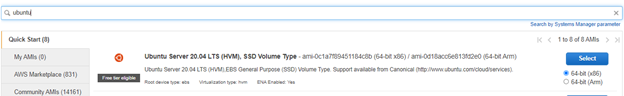

5. **Choose an Instance:**

Select t2.micro instance, which is free tire eligible

**Step 2:** choose an instance type.

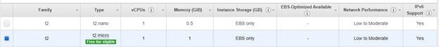

**6. Configure instance details:**

Configure all the details and then click on add storage.

**Step 3:** Select IAM role in the i am role drop down and choose your created EC2.

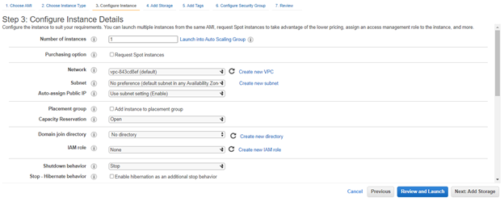

**7. Add storage:**

Add the storage size in the related fields for the instance.

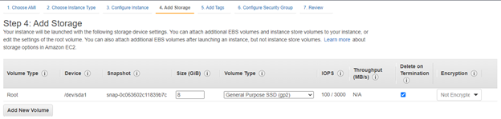

**8. Tag an instance:**

Type a name for your AWS EC2 instance in the value box. This name, more correctly known as a tag, will appear in the console when the instance launches. It makes it easy to keep of running machines in a complex environment. Use a name that you can easily recognize and remember.

**Step 5: Tag Instance**

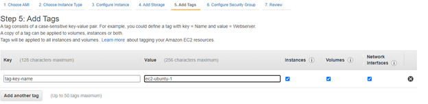

**9.** **Create a security group:**

**Step 6: Configure security group**

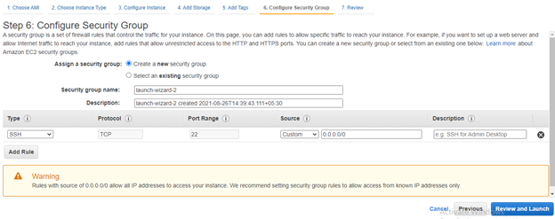

Open up SSH, HTTP and HTTPS — For SSH make sure to put in your specific address because we only want our ip to be to ssh inti our server. We can see a warning there that tells us its not save to make access privileges open to all ips

HTTP TCP 80 0.0.0.0/0

HTTP TCP 80 ::/0

SSH TCP 22 (YOUR IP ADDERSS)

HTTPS TCP 443 0.0.0.0/0

HTTPS TCP 443 ::/0

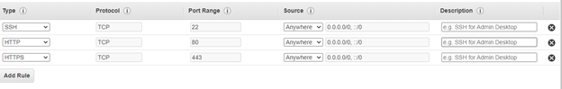

**10. Review and Launch:**

Click Review and Launch. You should already see your new instance in the list of running instances.

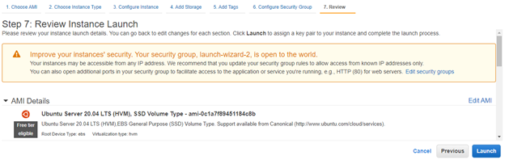

**11. Create a key pair & launch an instance:**

Next, in this AWS EC2 tutorial, select the option ‘create a new key pair’ and give a name of key pair. After, download it in your system and save it for future use.

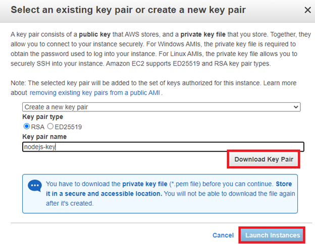

**12. Check the details of a launched instance.**

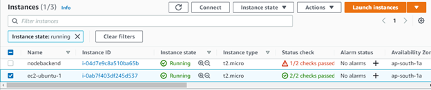

**13. Converting your private key using PuTTYgen**

Step1: Download and Install PuTTY ([link](https://www.putty.org/)).

PuTTY does not natively support the private key format (.pem) generated by Amazon EC2. PuTTY has a tool called PuTTYgen, which can convert keys to the required PuTTY format (.ppk). You must convert your private key into this format (.ppk) before attempting to connect to your instance using PuTTY.

Click Load. By default, PuTTYgen displays only files with the extension .ppk. To locate your .pem file, select the option to display files of all types.

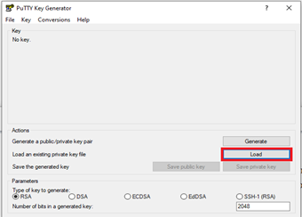

* Select your .pem file for the key pair that you specified when you launch your instance, and then click Open. Click OK to dismiss the confirmation dialog box.
* Click Save private key to save the key in the format that PuTTY can use. PuTTYgen displays a warning about saving the key without a passphrase. Click Yes.
* Specify the same name for the key that you used for the key pair (for example, my-key-pair). PuTTY automatically adds the .ppk file extension.

**14. connect to EC2 instance using SSH and PuTTY.**

* Open PuTTY.exe
* In the Host Name box, enter Public IP of your instance.
* In the Category list, expand SSH.
* Click Auth (don’t’ expand it).
* In the private key file for authentication box, browse to the PPK file that you downloaded and double-click it.
* Click Open.
* Then put server user name.

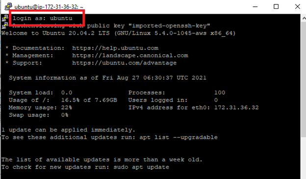

### 4. Installation of Apache Web:

**What is web server?** *First, we need to understand the different kinds of servers. The server where our database runs is called as a database server. The server we use for sending mails is called as a mail server. These are some examples of servers. Now we can start with what is the Web Server? Web server is used to serve content of websites over the network. When user request for any contest from the server, web server pulls the content from the server and delivers it to the web.*

**What is Apache Web Server?** *Apache is an open source web server which is available to use for free. It’s a most widely used web server in Linux OS, but it can be used on Windows as well. It allows users to get content on the web served by the server. We call it a web server, but it’s not a physical server, rather it’s an application that runs on the actual server.*

**Step 1 — Installing Apache:**

Apache is available within Ubuntu’s default software repositories, making it possible to install it using conventional package management tools.

Let’s begin by updating the local package index to reflect the latest upstream changes:

> $ sudo apt update

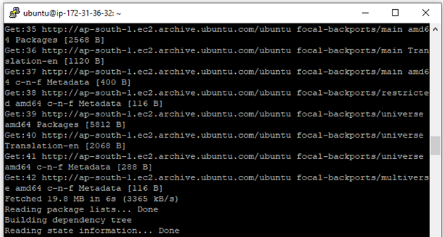

Update Completed.

Then, install the `apache2` package:

> $ sudo apt install apache2

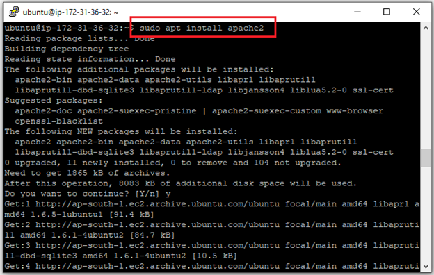

After confirming the installation, apt will install Apache and required dependencies.

**Step 2 — Adjusting the Firewall:**

Before testing Apache, it’s necessary to modify the firewall settings to allow outside access to the default web ports. Assuming that you followed the instructions in the prerequisites, you should have a UFW firewall configured to restrict access to your server.

During installation, Apache registers itself with UFW to provide a few application profiles that can be used to enable or disable access to Apache through the firewall.

> $ sudo ufw app list

You will receive a list of the application profiles:

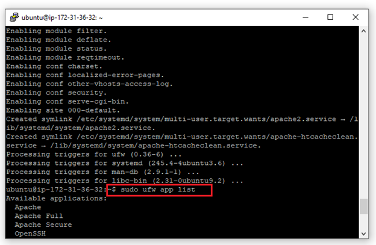

As indicated by the output, there are three profiles available for Apache:

* **Apache**: This profile opens only port 80 (normal, unencrypted web traffic)
* **Apache Full**: This profile opens both port 80 (normal, unencrypted web traffic) and port 443 (TLS/SSL encrypted traffic)
* **Apache Secure**: This profile opens only port 443 (TLS/SSL encrypted traffic)

It is recommended that you enable the most restrictive profile that will still allow the traffic you’ve configured. Since we haven’t configured SSL for our server yet in this guide, we will only need to allow traffic on port 80:

> $ sudo ufw allow Apache

You can verify the change by typing:

> $ sudo ufw status

The output will provide a list of allowed HTTP traffic:

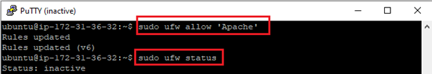

As indicated by the output, the profile has been activated to allow access to the Apache web server.

> $ sudo systemct1 status apache2

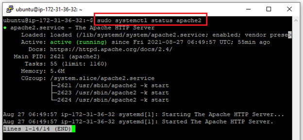

As confirmed by this output, the service has started successfully. However, the best way to test this is to request a page from Apache.

You can access the default Apache landing page to confirm that the software is running properly through your IP address.

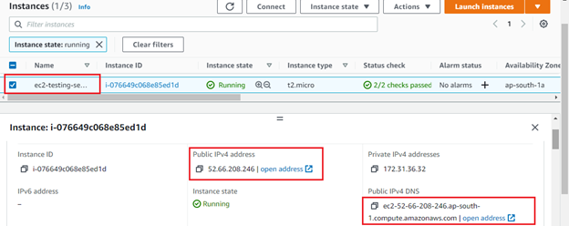

When you have your server’s IP address, enter it into your browser’s address bar:

> http://your_server_ip

You should see the default Ubuntu 20.04 Apache web page:

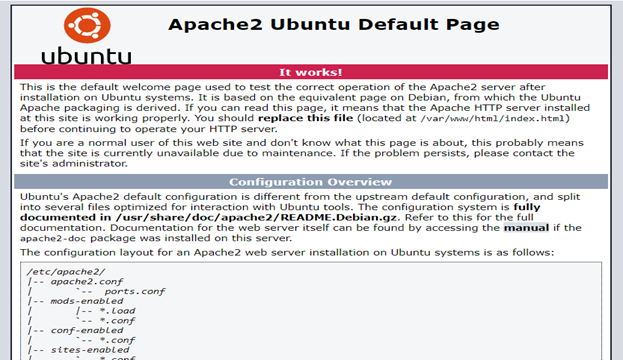

* If you see the above page, it means your Apache server is working fine.

**Step 5 — Setting Up Virtual Hosts:**

When using the Apache web server, you can use *virtual hosts* to encapsulate configuration details and host more than one domain from a single server. We will set up a domain called **your_domain_name**, but you should **replace this with your own domain name**.

Apache on Ubuntu 20.04 has one server block enabled by default that is configured to serve documents from the `/var/www/html` directory. While this works well for a single site, it can become unwieldy if you are hosting multiple sites. Instead of modifying `/var/www/html`, let’s create a directory structure within `/var/www/html` for a **your_domain_name** site, leaving `/var/www/html` in place as the default directory to be served if a client request doesn’t match any other sites.

I am create one folder for test_nodejs_application

We going to specific path cd /var/www/html/

/var/www/html mkdir test_nodejs_application

Mkdir test_nodejs_application

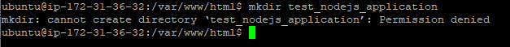

I try to create folder but getting error for cannot create directory. So we need to permission access.

> ls -1 /var/www
>
> sudo usermod -a -G www-data ubuntu
>
> exit

step1: sudo chown -R ubuntu:www-data /var/www

step2: sudo chmod 2775 /var/www

step3: find /var/www -type d -exec sudo chmod 2775 {} \;

step4: find /var/www -type f -exec sudo chmod 0664 {} \;

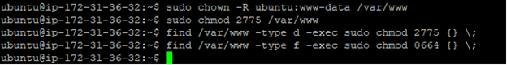

Again follow these steps.

We going to specific path cd /var/www/html/

> /var/www/html mkdir test_nodejs_application

successfully created.

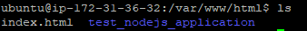

Alright now our Appache setup. let’s go to install mysql database.