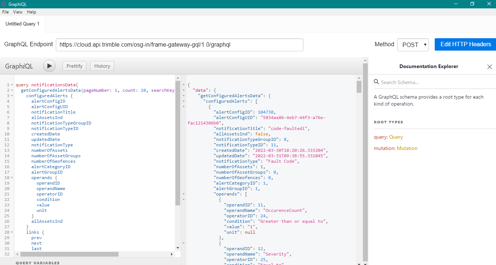

### Stacked Architecture.

Stacked is a simple to use, highly scalable, flexible and easily maintainable and testable Flutter MVVM(Model-View-ViewModel) architecture.

Previously known as the provider architecture, you begin to implement the stacked architecture on a flutter application by adding the libraries: [Stacked](https://pub.dev/packages/stacked) , [Stacked_services](https://pub.dev/packages/stacked_services). The stacked_services library, helps in implementing the stacked architecture, while the stacked library is the architecture itself.

The stacked architecture consists of 3 major aspects:

* ***View :*** Displays the UI to the user.
* ***ViewModel:*** Manages the business Logic, state of the view and other logic required by the users.
* ***Services:*** It wraps all the shared functionalities or feature sets e.g  database functionality, integrating APIs, and share data transfer between viewModels.

   Services in the stacked architecture are registered and shared with the 'get_it' service locator. Example, as shown below:-

> Remember to import the [get_it](https://pub.dev/packages/get_it) package and initiate a get_it instance.

```
final GetIt locator = GetIt.instance;

class LocatorInjector {
  static Future<void> setUpLocator() async {
    locator.registerLazySingleton(() => AssetService());
      }
    }
```

The get_it service locator is assigned to a global variable 'locator' which  is used to initiate the required service either on different service screens or viewModel to allow sharing of methods in that service.  For instance :-

```
AssetService? _assetService = locator<AssetService>();
```

From this, it will be very easy to pass on data returned from the integrated APIs found in the services to the view model.

### Integrating GraphQL APIs.


GraphQL is an  open-source data query and manipulation language  created by Facebook for APIs. It is used to precisely fetch only the required data working as an improvement of RestAPIs that does overfetching.

In order to successfully integrate GraphQL Apis to your application, you have to first ensure that the endpoints are working well i.e returning the required data/schemas; based on queries or mutations passed. To do this, you can use a free software created by Facebook called the GraphiQL. You can download it here: [Link](https://www.electronjs.org/apps/graphiql)

This software allows you to pass the specific queries, input required headers and view the response/ schemas.



### Creating Queries in GraphiQL.

depending on the developer